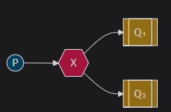
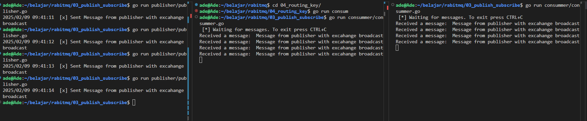

## What should you notice

Publisher will send message to exchange "broadcast" and all consumers that binded (with exchange "broadcast") will get message from exchange "broadcast".



### Create new Exchange with type fanout
set exchange type to "fanout".

```
ch.ExchangeDeclare(
		"broadcast",         // exchange name
		amqp.ExchangeFanout, // exchange type "fanout"
		false,               // durable
		false,               // auto-deleted
		false,               // internal
		false,               // no-wait
		nil,                 // arguments
	)
```


### Publish Message to Exchange
publish message to exchange "broadcast"
```
ch.Publish(
        "broadcast", // exchange name
        "",          // routing key
        false,       // mandatory
        false,       // immediate
        amqp.Publishing{
            ContentType: "text/plain",
            Body:        []byte("Hello World!"),
        })
```


### How Consumer get broadcast message from exchange "broadcast"
Binding the queue to exchange "broadcast"
```
ch.QueueBind(
		q.Name,      // queue name
		"",          // routing key
		"broadcast", // exchange
		false,       // no-wait
		nil,         // arguments
	)
```

### [optional] Declare exclusive queue
delete the queue after connection to the queue closed
```
ch.QueueDeclare(
		queueName, // name
		false,     // durable
		false,     // delete when unused
		true,      // exclusive
		false,     // no-wait
		nil,       // arguments
	)
```

## How to Run
publisher
```
go run publisher/publisher.go
```

consumer 1
```
go run consummer/consumer.go
```

consumer 2
```
go run consummer/consumer.go
```

result

