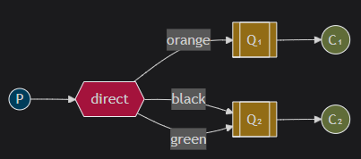
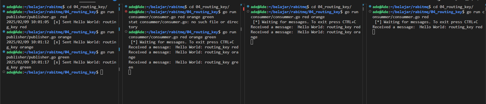

## What should you notice

- Publisher will send message to exchange (with type direct)
- the message have routing-key, either "red", "orange", or "green"
- consumer need to bind queue to matches routing-key
- consumer will get message based on routing-key



### Create new Exchange with type direct
- set exchange type to "direct".
```
ch.ExchangeDeclare(
	"your_exchange_name",	// exchange name
	amqp.ExchangeDirect, 	// exchange type "direct"
	false,               	// durable
	false,               	// auto-deleted
	false,               	// internal
	false,               	// no-wait
	nil,                 	// arguments
)
```


### Publish Message to Exchange
- set exchange name
- set routing key
```
ch.Publish(
	"your_exchange_name", 	// exchange name
	"orange",				// routing key
	false,       			// mandatory
	false,       			// immediate
	amqp.Publishing{
		ContentType: "text/plain",
		Body:        []byte("Hello World!"),
	})
```


### How Consumer get message
- create new queue
- bind queue to exchange
- set routing key
```
ch.QueueBind(
	q.Name,     			// queue name
	"orange",				// routing key
	"your_exchange_name",	// exchange
	false,       			// no-wait
	nil,         			// arguments
)
```

### [optional] Declare exclusive queue
delete the queue after connection to the queue closed
```
ch.QueueDeclare(
	queueName, // name
	false,     // durable
	false,     // delete when unused
	true,      // exclusive
	false,     // no-wait
	nil,       // arguments
)
```

## How to run

publisher
```
go run publisher/publisher.go red
```

consumer 1
```
go run consummer/consummer.go red orange green
```

consumer 2
```
go run consummer/consummer.go red orange
```

consumer 3
```
go run consummer/consummer.go red
```

result

