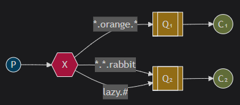
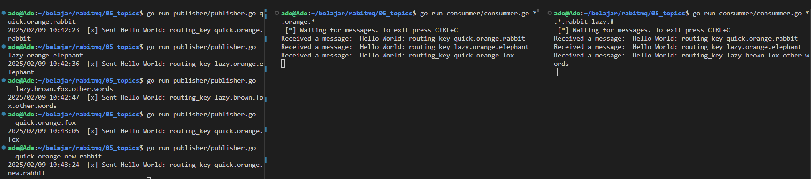

## What should you notice
* It almost same with [04_routing_key](../04_routing_key)
* But we set exchange type to "topic", and routing key use patterns:
  * \* (star) can substitute for exactly one word.
  * \# (hash) can substitute for zero or more words.
* example:




* `quick.orange.rabbit` will match with Q1 and Q2
* `lazy.orange.elephant` will match with Q1 and Q2
* `lazy.brown.fox.other.words` will only match with Q2
* `quick.orange.fox` will only match with Q1
* `quick.orange.new.rabbit` will not match with any binding, then it will be discard


### Create new Exchange with type topic
- set exchange type to "topic".
```
ch.ExchangeDeclare(
	"exchange_topic_name",	// exchange name
	amqp.Exchangetopic, 	// exchange type "topic"
	false,               	// durable
	false,               	// auto-deleted
	false,               	// internal
	false,               	// no-wait
	nil,                 	// arguments
)
```


### Publish Message to Exchange
- set exchange name
- set routing key
```
ch.Publish(
	"exchange_topic_name", 	// exchange name
	"quick.orange.rabbit",	// routing key
	false,       			// mandatory
	false,       			// immediate
	amqp.Publishing{
		ContentType: "text/plain",
		Body:        []byte("Hello World!"),
	})
```


### How Consumer get message
- create new queue
- bind queue to exchange
- set routing key
```
ch.QueueBind(
	q.Name,     				// queue name
	"pattern of routing key",	// routing key, eg: *.orange.*
	"exchange_topic_name",		// exchange
	false,       				// no-wait
	nil,         				// arguments
)
```

### [optional] Declare exclusive queue
delete the queue after connection to the queue closed
```
ch.QueueDeclare(
	"",     // name
	false,  // durable
	false,  // delete when unused
	true,   // exclusive
	false,  // no-wait
	nil,    // arguments
)
```

## How to run

publisher
```
go run publisher/publisher.go quick.orange.rabbit
```

consumer 1
```
go run consummer/consummer.go *.orange.*
```

consumer 2
```
go run consummer/consummer.go *.*.rabbit lazy.#
```


result

