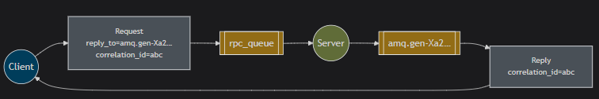
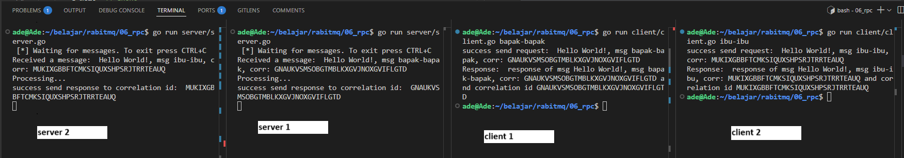

## What should you notice
* Client open new queue (eg: "amq.gen.Xa2...") and listen this queue
* Client send message to an queue "rpc_queue" (this name is arbitrary). the message have:
	* `correlation_id`: unique id for this message
	* `reply_to`: queue name that server will send response to (eg: "amq.gen.Xa2...")
* Server listen queue "rpc_queue" and get message from client
* Server process message
* Server send response(message) back to client trough queue "amq.gen.Xa2..."
* Client get response




### Exchange
for this example, we will use default exchange

## How to run

server 1
```
go run server/server.go
```

server 2
```
go run server/server.go
```

client 1
```
go run client/client.go your-message-1
```

client 2
```
go run client/client.go your-message-2
```


result

